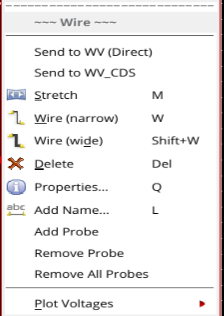
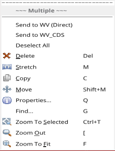
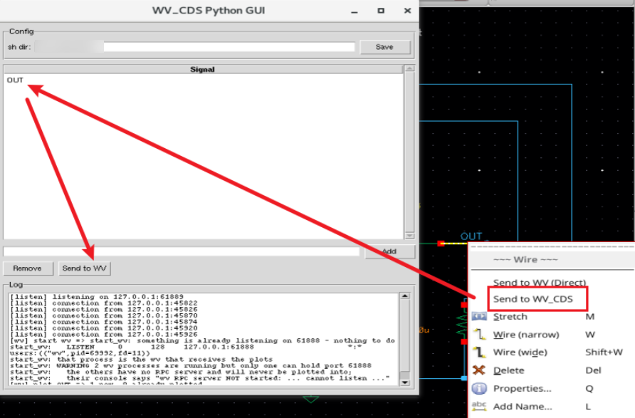

**English** | [中文](README.zh-CN.md)

# wv_cds — send schematic nets to wv (Custom WaveView)

Right-click a net in a Virtuoso schematic to plot it in wv:

| Right-click item | What it does |
|---|---|
| **Send to WV (Direct)** | plots straight in wv |
| **Send to WV_CDS** | puts the net in a small Python table; you plot from there when you are ready |

The items sit at the top of the net menu. **Shift-click to select several nets
at once** - one net or n, they are all sent together:

| One net | Several nets (Shift-click) |
|---|---|
|  |  |

Both items start whatever they need - you do not have to launch wv, source
`wv_rpc_server.tcl`, or start the Python GUI by hand.

## Requirements

- Linux, Virtuoso with the schematic editor
- `wv` (Synopsys Custom WaveView), startable as `wv -ace_gui <script>`
- Python 3 with Tkinter, for `Send to WV_CDS` only (`sudo apt install python3-tk`)

## Setup

**1. Get the package, then run the installer once**

```bash
git clone https://github.com/DoYourLLM/wv_cds.git
cd wv_cds
./install.sh
```

Using GitHub's **Download ZIP** instead? It unpacks to `wv_cds-main`, so the
`cd` is different:

```bash
unzip wv_cds-main.zip
cd wv_cds-main
./install.sh
```

The folder name does not matter - `install.sh` records wherever the package
actually is. It makes the scripts executable, writes that location into the
three files that need an absolute path, checks the prerequisites, and prints
the line for step 2. Re-run it if you move the folder.

**2. Add one line to the `.cdsinit` in the directory you start Virtuoso from**

```skill
load("/where/you/put/wv_cds/skill/load_wv_cds.il")
```

Virtuoso reads that file at startup; create it if it is not there. `install.sh`
prints this exact line for you.

(You can put it in `~/.cdsinit` instead, but that applies to every Virtuoso
session rather than just this project.)

Or rename `skill/cdsinit.wv_cds` to `.cdsinit` and drop it in that directory.

**3. Start Virtuoso, open a schematic, right-click a net**

Select the net(s) first - multi-select and descend-into-subcell both work. The
two items are at the top of the menu. After loading, the CIW prints
`wv_cds loaded: ...`.

## The Send to WV_CDS flow



1. Right-click the net and pick **Send to WV_CDS**.
2. The net shows up in the table at the top of the **WV_CDS Python GUI**.
3. Select the rows you want and press **Send to WV** to plot them in wv.

## Starting wv yourself (optional)

Both right-click items start wv when they need it, so this is only for bringing
wv up before you touch Virtuoso:

```bash
./start_wv.sh        # foreground
./start_wv.sh -b     # background; returns once the RPC port answers
./start_wv.sh -h     # help
```

It runs the same command the right-click items use -
`wv -ace_gui <package>/wv_rpc_server.tcl` - so the RPC server comes up on 61888
and Virtuoso can talk to this wv.

Open the waveform file inside wv; plotting resolves against whatever file that
wv has open, so there is nothing to configure. To have the direct path open a
fixed file for you instead, set `WV_CDS_FSDB` in `skill/wv_cds_config.il`.

## How it works

```
right-click a net --> CCSwvPlotSelectedSignals
  |-- Send to WV (Direct) --> wv_cds_openfsdb.sh   (only when WV_CDS_FSDB is set)
  |                           wv_cds_plot.sh  --> 127.0.0.1:61888  (wv's RPC server)
  +-- Send to WV_CDS ------> wv_cds_add.sh   --> 127.0.0.1:61889  (Python GUI)
                              Send to WV in the GUI --> wv_cds_plot.sh --> 61888
```

61888 is wv's own RPC server and 61889 is the Python GUI's listener; they are
separate ports because two servers cannot share one.

## Files

| Path | What it is |
|---|---|
| `install.sh` | one-time setup; run it first |
| `start_wv.sh` | start wv by hand, with the RPC server loaded (optional) |
| `skill/wv_cds_config.il` | **the only file you normally edit** |
| `skill/load_wv_cds.il` | loads the rest; this is what `.cdsinit` calls |
| `python/wv_cds_gui.py` | the table window |
| `wv_cds_*.sh` | the scripts that talk to wv over the RPC port |
| `wv_rpc_server.tcl` | the RPC server that runs inside wv |

`skill/README.md` and `python/README.md` cover those two halves.

## Notes

- **A signal is displayed once.** `wv_cds_plot.sh` remembers the names it has
  handed to wv in a Tcl variable inside wv (`::wv_cds_plotted`), so clicking the
  same net again does not stack a duplicate curve. Restarting wv, or opening a
  file, resets it.
- wv takes a while to come up, so the first `Send to WV (Direct)` click often
  starts it and skips the plot; click again once it is up.
- If the GUI's `sh dir` box is empty, **Send to WV** does nothing - it has to
  point at this package.
- Net names are wrapped in double quotes for the shell, so avoid names
  containing `"`, `$` or backticks.
- A net that sits on a pin of the current cellview is the port net, and its
  signal is named one level up: `I0.I1.n1` becomes `I0.n1`.
- No file contains a machine specific path except the three `install.sh` fills
  in, and the code is ASCII apart from em dashes in comments.
